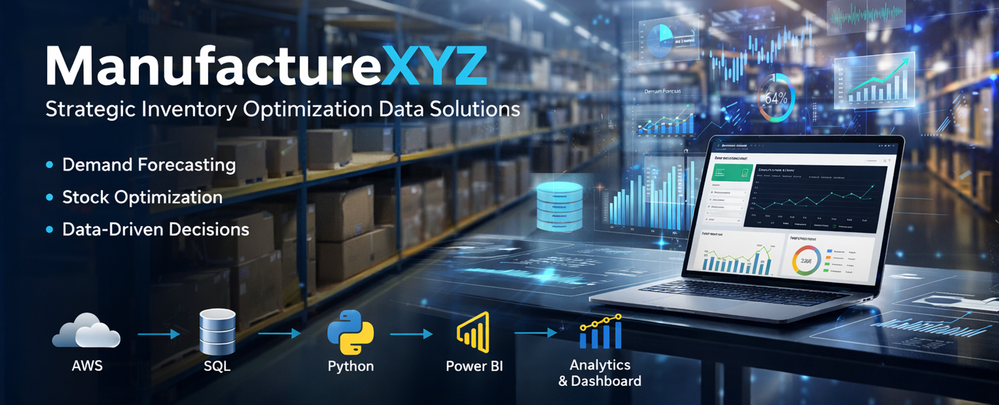

[](./Img/Banner.png)
# 📊 Optimización Estratégica de Manufacturera XYZ
## 🍷 Retail de Bebidas – Gestión Multisucursal con Stock Centralizado

Una empresa de retail de bebidas con múltiples sucursales y stock centralizado enfrenta desafíos en la gestión del inventario, incluyendo quiebres frecuentes en productos de alta rotación, acumulación de stock innecesario y baja visibilidad sobre la demanda real por sucursal.

Este proyecto desarrolla una solución analítica integral que conecta auditoría de datos, modelado relacional, análisis predictivo y visualización estratégica, permitiendo transformar información operativa en decisiones basadas en datos.

---

## 📚 Tabla de Contenido
1. [🎯 Objetivo del Proyecto](#-objetivo-del-proyecto)
2. [📁 Estructura del Repositorio](#-estructura-del-repositorio)
3. [🔄 Flujo Integral del Proyecto](#-flujo-integral-del-proyecto)
4. [🧩 Estrategia de Implementación](#-estrategia-de-implementación)
5. [🛠️ Stack Tecnológico](#️-stack-tecnológico)
6. [🚧 Estado y Avance del Proyecto](#-estado-y-avance-del-proyecto)
7. [🛣️ Fases Futuras de Proyecto](#️-fases-futuras-del-proyecto)
8. [🚀 Posibles Mejoras y Evolución](#-posibles-mejoras-y-evolución)
9. [💼 Impacto Estratégico](#-impacto-estratégico)
10. [👥 Integrantes del Proyecto](#-integrantes-del-proyecto)
11. [📜 Licencia](#-licencia)

---

## 🎯 Objetivo del Proyecto

Construir una base analítica estructurada que permita mejorar la gestión del inventario mediante el análisis de ventas, compras e inventarios históricos.

El enfoque apunta a evolucionar desde una gestión reactiva hacia una gestión predictiva basada en datos confiables y modelos analíticos.

---

## 📁 Estructura del Repositorio

```bash
Manufacturera XYZ/
├── AWS-Inventory-ETL/
│   ├── Code/
│   │   ├── Glue_cleaning.py
│   │   ├── Lambda_ingesta.py
│   │   └── Lambda_to_sql.py
│   ├── Img/
│   └── Readme.md
│
├── Data/
│   ├── ETL.ipynb
│   └── README.md
│
├── Img/
│   ├── Banner.png
│   └── Flujo integral del Proyecto.png
│
├── SQL/
│   ├── Img/
│   ├── ManufacturingCompany_COMPLETO.sql
│   └── README.md
│
├── .gitignore
├── LICENSE
└── README.md
```
---

## 🔄 Flujo Integral del Proyecto

1. **Fuente de Datos**  
   Dataset público (Kaggle): https://www.kaggle.com/datasets/bhanupratapbiswas/inventory-analysis-case-study

2. **Auditoría y Exploración Inicial**  
   📂 Ver carpeta: [Data](./Data)

3. **Creación de Base de Datos y Modelo Relacional**  
   📂 Ver carpeta: [SQL](./SQL)

4. **Automatización del Flujo de Datos en la Nube (AWS ETL)**  
   📂 Ver carpeta: [AWS-Inventory-ETL](./AWS-Inventory-ETL)

5. **Análisis EDA y Modelado Predictivo**  
   *(pendiente / en desarrollo)*

6. **Visualización Estratégica y Presentación al Cliente Final**  
   *(pendiente / en desarrollo)*

[](./Img/Flujo%20integral%20del%20Proyecto.png)

---

## 🧩 Estrategia de Implementación

El proyecto fue desarrollado siguiendo una lógica progresiva:

1. Auditoría inicial para evaluar calidad y estructura del dato.  
2. Diseño relacional para garantizar integridad y rendimiento.  
3. Automatización del flujo ETL en AWS.  
4. Análisis exploratorio y modelado predictivo.  
5. Visualización ejecutiva enfocada en métricas estratégicas.

---

## 🛠️ Stack Tecnológico

- Python (Pandas, NumPy)
- Scikit-learn
- AWS Glue & AWS Lambda
- SQL Server
- Power BI

---

## 🚧 Estado y Avance del Proyecto

El proyecto se encuentra en una etapa funcional, con pipeline ETL implementado, modelo relacional construido y recursos gráficos listos para documentación y presentación.

---

## 🛣️ Fases Futuras del Proyecto

Las siguientes etapas representan funcionalidades que forman parte de la evolución natural del proyecto y aún se encuentran en desarrollo:

1️⃣ **Exploración completa de datos (EDA)** para profundizar el análisis del comportamiento del inventario.  
2️⃣ **Implementación del modelo predictivo de demanda** utilizando técnicas de Machine Learning.  
3️⃣ **Definición y construcción de KPIs estratégicos** orientados a la rotación, quiebres y eficiencia operativa.  
4️⃣ **Desarrollo de alertas predictivas** basadas en patrones históricos para anticipar riesgos de desabastecimiento o sobrestock.

Estas fases permitirán consolidar el paso desde un análisis descriptivo hacia una arquitectura analítica predictiva.


## 🚀 Posibles Mejoras y Evolución

Como líneas de crecimiento futuras, el proyecto podría ampliarse mediante:

✨ **Integración con servicios cloud avanzados** para ejecutar modelos de Machine Learning directamente en la nube.  
✨ **Implementación de pipelines analíticos más robustos** orientados a análisis en tiempo casi real.  
✨ **Incorporación de modelos avanzados de series temporales** para mejorar la precisión de las predicciones.  
✨ **Expansión del ecosistema analítico** hacia aplicaciones interactivas que faciliten la toma de decisiones operativas.

Estas mejoras no forman parte del alcance actual, pero representan oportunidades de escalabilidad y madurez tecnológica.

---

## 💼 Impacto Estratégico

Este proyecto transforma la gestión del inventario en una capacidad analítica estratégica.

Mediante la consolidación de datos, el modelado estructurado y la incorporación de análisis predictivo, la organización logra mayor visibilidad operativa, optimiza la planificación de compras y fortalece su capacidad de anticipación frente a cambios en la demanda.

El resultado es una toma de decisiones más precisa, una reducción de ineficiencias operativas y una base tecnológica preparada para evolucionar hacia una gestión predictiva y escalable.

---

## 👥 Integrantes del Proyecto

- **Dalma Leguizamon** — Data Engineer & Machine Learning Analyst  
- **Sebastián Lombardi** — Business Intelligence Developer  
- **Brixia Méndez** — Data Analyst & Data Engineer  
- **Nicolás Choque** — Database Engineer  

---

## 📜 Licencia

Este proyecto se distribuye bajo [MIT](./LICENSE).
