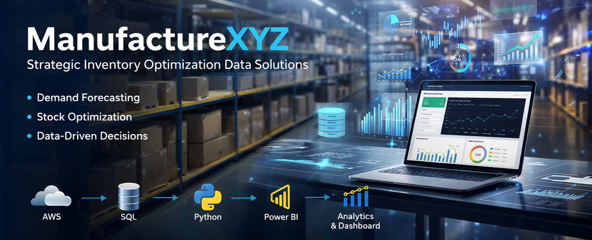

[](./Img/Banner.png)
# 📊 Optimización Estratégica de Manufacturera XYZ
## 🍷 Retail de Bebidas – Gestión Multisucursal con Stock Centralizado

Una empresa de retail de bebidas con múltiples sucursales y stock centralizado enfrenta desafíos en la gestión del inventario, incluyendo quiebres frecuentes en productos de alta rotación, acumulación de stock innecesario y baja visibilidad sobre la demanda real por sucursal.

Este proyecto desarrolla una solución analítica integral que conecta auditoría de datos, modelado relacional, análisis predictivo y visualización estratégica, permitiendo transformar información operativa en decisiones basadas en datos.

---

## 📚 Tabla de Contenido
1. [🎯 Objetivo del Proyecto](#-objetivo-del-proyecto)
2. [📁 Estructura del Repositorio](#-estructura-del-repositorio)
3. [🔄 Flujo Integral del Proyecto](#-flujo-integral-del-proyecto)
4. [🧩 Estrategia de Implementación](#-estrategia-de-implementación)
5. [🛠️ Stack Tecnológico](#️-stack-tecnológico)
6. [📊 EDA Estratégico de Inventario y Abastecimiento](#-eda-estratégico-de-inventario-y-abastecimiento)
7. [📦 Stock Intelligence Engine](#-stock-intelligence-engine)
8. [📈 Dashboard Ejecutivo](#-dashboard-ejecutivo)
9. [🚀 Posibles Mejoras y Evolución](#-posibles-mejoras-y-evolución)
10. [💼 Impacto Estratégico](#-impacto-estratégico)
11. [👥 Integrantes del Proyecto](#-integrantes-del-proyecto)
12. [📜 Licencia](#-licencia)

---

## 🎯 Objetivo del Proyecto

Construir una base analítica estructurada que permita mejorar la gestión del inventario mediante el análisis de ventas, compras e inventarios históricos.

El enfoque apunta a evolucionar desde una gestión reactiva hacia una gestión predictiva basada en datos confiables y modelos analíticos.

---

## 📁 Estructura del Repositorio

```bash
Manufacturera XYZ/
├── AWS-Inventory-ETL/
│   ├── Code/
│   │   ├── Glue_cleaning.py
│   │   ├── Lambda_ingesta.py
│   │   └── Lambda_to_sql.py
│   ├── Img/
│   └── Readme.md
│
├── Data/
│   ├── ETL.ipynb
│   └── README.md
│
├── EDA/
│   ├── Documentacion EDA.pdf 
│   ├── Exploratory_EDA_analysis.ipynb
│   └── README.md
│
├── Img/
│   ├── Banner.png
│   └── Flujo integral del Proyecto.png
│
├── Modelo-Predictivo/
│   ├── Doc. Stock_Intelligence_Engine.pdf
│   ├── README.md
│   └── Stock_Intelligence_Engine.ipynb
│
├── SQL/
│   ├── Img/
│   ├── ManufacturingCompany_COMPLETO.sql
│   └── README.md
│
├── .gitignore
├── LICENSE
└── README.md
```
---

## 🔄 Flujo Integral del Proyecto

1. **Fuente de Datos**  
   Dataset público (Kaggle): https://www.kaggle.com/datasets/bhanupratapbiswas/inventory-analysis-case-study

2. **Auditoría y Exploración Inicial**  
   📂 Ver carpeta: [Data](./Data)

3. **Creación de Base de Datos y Modelo Relacional**  
   📂 Ver carpeta: [SQL](./SQL)

4. **Automatización del Flujo de Datos en la Nube (AWS ETL)**  
   📂 Ver carpeta: [AWS-Inventory-ETL](./AWS-Inventory-ETL)

5. **Análisis EDA Estratégico**  
   📂 Ver carpeta: [EDA](./EDA)

6. **Stock Intelligence Engine**  
   📂 Ver carpeta: [Modelo-Predictivo](./Modelo-Predictivo)

7. **Dashboard Ejecutivo**

[](./Img/Flujo%20integral%20del%20Proyecto.png)

---

## 🧩 Estrategia de Implementación

El proyecto fue desarrollado siguiendo una lógica progresiva:

1. Auditoría inicial para evaluar calidad y estructura del dato.  
2. Diseño relacional para garantizar integridad y rendimiento.  
3. Automatización del flujo ETL en AWS.  
4. Análisis exploratorio y modelado predictivo.  
5. Visualización ejecutiva enfocada en métricas estratégicas.

---

## 🛠️ Stack Tecnológico

- Python (Pandas, NumPy)
- Scikit-learn
- AWS Glue & AWS Lambda
- SQL Server
- Power BI

---

## 📊 EDA Estratégico de Inventario y Abastecimiento

El EDA convierte datos transaccionales en diagnóstico de negocio.

### 📅 Magnitud del sistema
- 🧾 SKUs: 12.261
- 🏬 Sucursales: 80
- 🛒 Ventas: USD 33,1M
- 📦 Capital inmovilizado: USD 55,29M

El capital en inventario supera la facturación anual del período, confirmando su impacto financiero.

### 🅰️🅱️🅾️ Clasificación ABC

Distribución del capital:
- 🅰️ 63,83% (~USD 35,3M)
- 🅱️ 20,65% (~USD 11,42M)
- 🅾️ 15,51% (~USD 8,58M)

La inversión sigue la lógica económica del negocio (Pareto).

- 🔄 Rotación y Capital Lento
- 💸 Capital lento (Rotación ≤ 3): USD 17,2M
- 📊 Representa 31,12% del capital total

Un tercio del capital tarda demasiado en volver a liquidez.

### ⚠️ Salud Operativa

- 1.939 productos con quiebre operativo (16,86%)
- 52 productos en riesgo crítico (A/B relevantes)
- Sobrestock extremo prácticamente inexistente
- 12 tiendas con desbalances puntuales

Conclusión: sistema estable, con oportunidades de optimización fina.

### 🚚 Logística y Dependencia

- 126 proveedores
- Lead time promedio: 7–8 días
- 10.635 productos exclusivos

El abastecimiento es homogéneo, pero con baja redundancia en productos críticos.

---

## 📦 Stock Intelligence Engine

Motor determinístico de decisiones de compra basado en riesgo financiero.
Responde:
¿Cuándo comprar?
¿Qué productos priorizar?
¿Cuánto dinero se pierde si no se compra?
No predice cuánto se venderá.
Predice cuándo no comprar se vuelve costoso.

### ⚙️ Funcionamiento

### Integra:
- Stock actual
- Consumo histórico
- Clasificación ABC
- Lead time
- Precio representativo

### Calcula:
- Días de cobertura
- Fecha de quiebre estimada
- Días de quiebre potencial
- Unidades en riesgo
- Impato económico estimado

### Salida operativa:
COMPRAR YA
OK

Modelo transparente, auditable y orientado a acción.

---

## 📈 Dashboard Ejecutivo

El dashboard está estructurado en bloques estratégicos:

1️⃣ Resumen Ejecutivo

- Capital total y capital lento
- Productos en riesgo
- Impacto financiero potencial

2️⃣ Demanda, ABC y Rotación

- Distribución ABC
- Rotación por categoría
- Capital lento por tipo

3️⃣ Demanda vs Stock

- Matriz 2x2 de tiendas
- Desbalances operativos

4️⃣ Lead Time y Dependencia

- Clasificación de proveedores
- Capital expuesto por proveedor

5️⃣ Working Capital

- Concentración de capital por sucursal
- Top tiendas por capital
- Capital lento estructural

6️⃣ Forecast y Recomendaciones

- Productos con recomendación automática
- Impacto financiero estimado
- Prioridad de compra
- El diseño sigue una progresión lógica:

Diagnóstico → Riesgo → Impacto → Acción.

---

## 🚀 Posibles Mejoras y Evolución

Como líneas de crecimiento futuras, el proyecto podría ampliarse mediante:

✨ **Integración con servicios cloud avanzados** para ejecutar modelos de Machine Learning directamente en la nube.  
✨ **Implementación de pipelines analíticos más robustos** orientados a análisis en tiempo casi real.  
✨ **Incorporación de modelos avanzados de series temporales** para mejorar la precisión de las predicciones.  
✨ **Expansión del ecosistema analítico** hacia aplicaciones interactivas que faciliten la toma de decisiones operativas.

Estas mejoras no forman parte del alcance actual, pero representan oportunidades de escalabilidad y madurez tecnológica.

---

## 💼 Impacto Estratégico

Este proyecto transforma la gestión del inventario en una capacidad analítica estratégica.

Mediante la consolidación de datos, el modelado estructurado y la incorporación de análisis predictivo, la organización logra mayor visibilidad operativa, optimiza la planificación de compras y fortalece su capacidad de anticipación frente a cambios en la demanda.

El resultado es una toma de decisiones más precisa, una reducción de ineficiencias operativas y una base tecnológica preparada para evolucionar hacia una gestión predictiva y escalable.

---

## 👥 Integrantes del Proyecto

- **Dalma Leguizamon** — Data Engineer & Machine Learning Analyst  
  🔗 [GitHub](https://github.com/DMLLeguizamon)

- **Sebastián Lombardi** — Business Intelligence Developer  
  🔗 [GitHub](https://github.com/SebastianLombardi)

- **Brixia Méndez** — Data Analyst & Data Engineer  
  🔗 [GitHub](https://github.com/Bricia17)

- **Nicolás Choque** — Database Engineer  
  🔗 [GitHub](https://github.com/nicochoque)


---

## 📜 Licencia

Este proyecto se distribuye bajo [MIT](./LICENSE).
